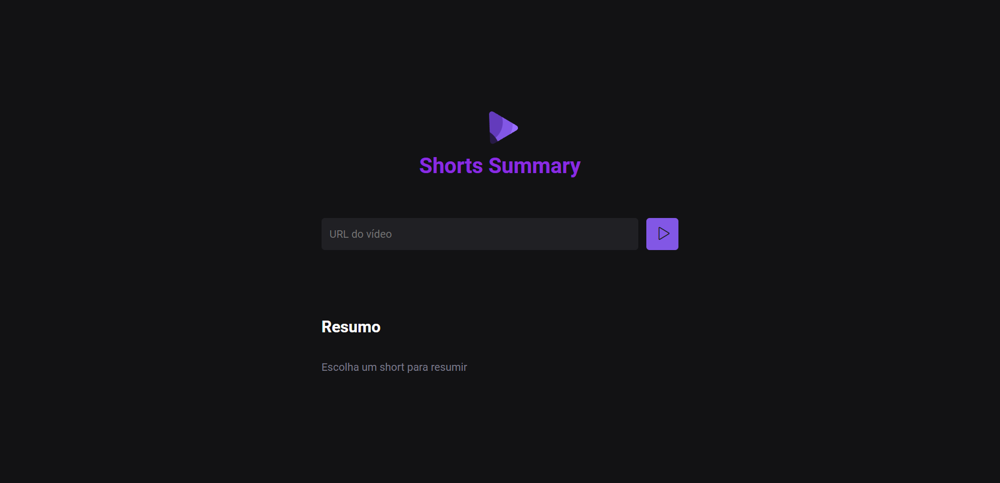

# NLW_IA
#### Esse é o projeto que eu desenvolvi durante a next level week IA da Rocketseat em 2023.
#### Trata-se de um sistema web para resumir videos shorts do youtube.
#### Ele utiliza de dois modelos de IA no processo de resumo: o "Xenova/whisper-small"
#### para o speech recognition do vídeo e o modelo "Xenova/distilbart-cnn-12-6" para o resumo em sí.
#### Utilizei o node.js e o vite para o desenvolvimento do site.

